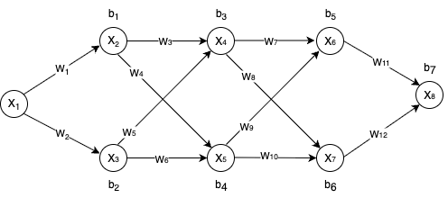

# Partial Derivatives Calculation in Neural Networks

## Overview

This document explains how partial derivatives were calculated for each parameter (weights and biases) with respect to the loss function in the backpropagation function.

## Loss Function

The loss function used is Squared Error:

$L = (y - ŷ)²$

Where:
- `y` is the actual target value
- `ŷ` is the predicted value from the neural network (the output of the final layer)

## Neural Network Architecture

For this explanation, I'll use a neural network with the following architecture:
- **Layer 1 (Input)**: 1 neuron
- **Layer 2 (Hidden)**: 2 neurons  
- **Layer 3 (Hidden)**: 2 neurons
- **Layer 4 (Hidden)**: 2 neurons
- **Layer 5 (Output)**: 1 neuron

## Chain Rule Application

When computing partial derivatives for parameters, we need to get the partial derivative of each parameter with respect to the loss function.

Since the loss function is $(y - ŷ)²$, which is a composite function, we need to employ the chain rule:

$$
\frac{\partial \mathcal{L}}{\partial \theta} = 2(y - \hat{y}) \cdot \frac{\partial (y - \hat{y})}{\partial \theta}
$$

When we substitute $ŷ$ with the weighted sum in the second part and simplify, we get the following equations:

### Derivative of Weights

$$
\frac{\partial \mathcal{L}}{\partial \theta} = -2(y - \hat{y}) \cdot \left( \text{product of weights in path to output} \right) \cdot \left( \text{derivative of activation function} \right) \cdot \left( \text{weighted sum of previous neuron} \right)
$$

### Derivative of Biases

$$
\frac{\partial \mathcal{L}}{\partial \theta} = -2(y - \hat{y}) \cdot \left( \text{product of weights in path to output} \right) \cdot \left( \text{derivative of activation function} \right)
$$

### Product of weights in path to output
The product of weights in path to output can be calculated using the following formula:

$$
n^{th}\text{ layer weights},\quad (n-1)^{th} \text{ layer weights},\quad \ldots,\quad x_{i+1}^{j} \text{ weights}
$$

where:
- n = last layer
- $i =$ current layer, therefore $(i+1)$ equals layer after current one
- $j =$ the index of the neuron in the current layer.

This calculation involves computing the sum of all possible paths from the current neuron to the output layer. For each path, we multiply the weights along that path. This is done by taking the dot product of weights from all layers after the current layer, but for the layer immediately following the current one, we only include the weight that connects to the neuron with the same index as the current neuron. This dot product multiplication should start from the last layer and move backwards.

### Derivative for ReLU activation function:

$$
\text{ReLU}’(x) =
\begin{cases}
1 & \text{if } x > 0 \\
0 & \text{if } x \leq 0
\end{cases}
$$

## Examples based on the above neural network diagram
### Example: Weight $w_{11}$ connecting neuron $x_6$ to $x_8$:

$$
\frac{\partial \mathcal{L}}{\partial w_{11}} = -2(y - \hat{y}) \cdot \text{ReLU}’(x_8) \cdot x_6
$$

### Example: Bias $b_7$ of neuron $x_8$

$$
\frac{\partial \mathcal{L}}{\partial b_7} = -2(y - \hat{y}) \cdot \text{ReLU}’(x_8)
$$

### Example: Weight $w_1$ connecting neuron $x_1$ to $x_2$:

$$
\frac{\partial \mathcal{L}}{\partial w_1} = -2(y - \hat{y}) \cdot \Bigl[ w_{11}(w_7 w_3 + w_9 w_4) + w_{12}(w_8 w_3 + w_{10} w_4) \Bigr] \cdot \text{ReLU}'(x_2) \cdot x_1
$$

### Example: Bias $b_1$ of neuron $x_1$:

$$
\frac{\partial \mathcal{L}}{\partial b_1} = -2(y - \hat{y}) \cdot \Bigl[ w_{11}(w_7 w_3 + w_9 w_4) + w_{12}(w_8 w_3 + w_{10} w_4) \Bigr] \cdot \text{ReLU}'(x_2)
$$

In the above two examples we get the product of weights in path to output by doing the following:

$$
\begin{bmatrix}
w_{11} & w_{12}
\end{bmatrix}
\cdot
\begin{bmatrix}
w_7 & w_9 \\
w_8 & w_{10}
\end{bmatrix}
\cdot
\begin{bmatrix}
w_3 \\
w_4
\end{bmatrix}
$$

where:

- $\begin{bmatrix}w_{11} & w_{12}\end{bmatrix} =$ all weights of last layers neuron's

- $ \begin{bmatrix} w_7 & w_9 \\ w_8 & w_{10}\end{bmatrix} =$ all weights of third hidden layer's neuron's

- $\begin{bmatrix} w_3 \\ w_4 \end{bmatrix}=$ The first weight of each neuron in the second hidden layer

## Parameter Update Rule

Once the partial derivatives are computed, parameters are updated using gradient descent:

$$
\theta_{\text{new}} = \theta_{\text{old}}-\left( \text{learning\_rate} \cdot \frac{\partial \mathcal{L}}{\partial \theta} \right)
$$
